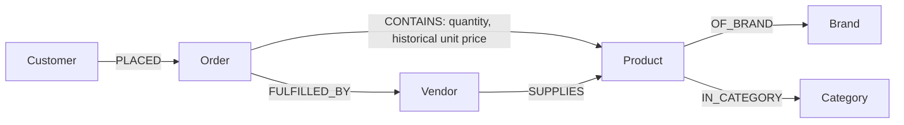

# E-commerce Knowledge Graph + AI Retrieval

A working Python project using **NetworkX** for a directed property graph and **Groq or OpenAI** for natural-language query planning and evidence-based answer presentation. Includes a sample dataset, CLI, optional Streamlit interface, ten reproducible questions/results, and verification tests. See the [assignment completion checklist](docs/REQUIREMENTS_CHECKLIST.md) for a requirement-by-requirement audit.

```text
User question
    ↓
Groq/OpenAI → structured graph query
    ↓ schema/type/direction/budget validation
NetworkX traversal → evidence rows + source nodes/relationships
    ↓
Groq/OpenAI → structured answer presentation
    ↓ evidence-ID validation + deterministic rendering
Answer containing only retrieved graph values and computed aggregates
```

## 1. Setup

**Requirements:** Python 3.10+ (3.12 recommended), internet for package installation. Live LLM mode additionally requires a Groq or OpenAI API key and a model that supports strict structured outputs. No Neo4j server is needed.

From the project directory:

```bash
python3 -m venv .venv
source .venv/bin/activate
python -m pip install -e ".[dev,ui]"
```

On Windows, activate with `.venv\Scripts\activate` instead. The `ui` extra installs Streamlit; omit it if only using the CLI.

Alternatively, with [uv](https://docs.astral.sh/uv/):

```bash
uv venv --python 3.12
source .venv/bin/activate
uv pip install -e ".[dev,ui]"
```

The uv setup was used to verify this project. If a Linux system lacks `ensurepip`, use uv or install the system's Python venv package.

### Start immediately, without an API key

```bash
ecommerce-kg inspect
ecommerce-kg questions
ecommerce-kg demo
ecommerce-kg ask "Which products from Brand X are supplied by Vendor Y?" --trace
ecommerce-kg ask "How many products contain the keyword banana?"
```

`offline` is the default: it maps the ten documented sample questions to predefined query plans, then executes real graph retrieval. It is explicitly a deterministic demo backend, **not an LLM**. Capitalization, whitespace and final punctuation can vary. Use `--mode groq` or `--mode openai` for new natural-language questions.

The equivalent module entry point is `python -m ecommerce_kg`, for example:

```bash
python -m ecommerce_kg inspect
```

## 2. Live LLM integration

Copy the example environment file:

```bash
cp .env.example .env
```

### Groq

Set these values in `.env`:

```dotenv
GROQ_API_KEY=your-groq-key-here
GROQ_MODEL=openai/gpt-oss-20b
```

The Groq backend uses the existing OpenAI Python SDK with Groq's compatible endpoint, `https://api.groq.com/openai/v1`. It makes real LLM calls for both query planning and evidence presentation, with `strict: true` JSON-schema outputs and the same graph/answer validators. No additional SDK dependency is needed.

```bash
ecommerce-kg ask --mode groq "Which products from Brand X are supplied by Vendor Y?" --trace
ecommerce-kg ask --mode groq "Which products contain the keyword banana?" --json
ecommerce-kg ask --mode groq "What is the total value of delivered orders?"
ecommerce-kg demo --mode groq --delay-seconds 65 --output docs/groq_sample_results.json
```

`openai/gpt-oss-20b` is the default Groq model. `openai/gpt-oss-120b` is another strict-structured-output model supported by Groq. Override with `--model MODEL_NAME` or `GROQ_MODEL`; check [Groq's supported structured-output models](https://console.groq.com/docs/structured-outputs) when selecting another model.

The optional `--delay-seconds` (0..120) pauses between demo questions. A 65-second interval was used for the live batch to accommodate this account's token-per-minute limit. Individual CLI/UI questions also report provider rate-limit errors cleanly; no offline answer is substituted.

### OpenAI

For the OpenAI provider, set these values in `.env`:

```dotenv
OPENAI_API_KEY=your-key-here
OPENAI_MODEL=gpt-4o-mini
```

The CLI loads `.env` from the current directory; the UI loads it from the project directory. Existing environment variables take precedence. `.env` is ignored by version control.

```bash
ecommerce-kg ask --mode openai "Which products from Brand X are supplied by Vendor Y?" --trace
ecommerce-kg ask --mode openai "Which vendors supply products in Groceries?" --json
ecommerce-kg ask --mode openai "What is the total value of delivered orders?"
ecommerce-kg demo --mode openai --output docs/live_results.json
```

`--model MODEL_NAME` overrides the selected provider's model setting. Each live provider makes two structured-output calls for a nonempty result: query planning, then evidence presentation. Empty row results bypass the second call and return a fixed no-match response. API errors, refusals, invalid queries and invalid evidence IDs produce an error; live mode does not silently fall back to offline mode.

## 3. Visual demonstration

```bash
streamlit run app.py
```

Open the printed local URL, normally `http://localhost:8501`. Choose **Groq live**, **OpenAI live** or **Offline demo**, select/type a question and click **Retrieve answer**. Expand the query and evidence panels to inspect the full flow. The graph explorer shows the complete graph, the `banana` neighborhood, or the last answer's source nodes and exactly the retrieved relationships. Download buttons export answers/evidence and the graph.

## 4. Dataset and knowledge graph

The included [sample dataset](src/ecommerce_kg/data/ecommerce.json) is synthetic and contains:

| Entity | Count | Main properties |
| --- | ---: | --- |
| Product | 12 | id, name, price_cents, currency, optional keyword |
| Brand | 3 | id, name |
| Category | 4 | id, name |
| Vendor | 3 | id, name, city |
| Order | 7 | id, placed_on, status, total_cents, currency |
| Customer | 5 | id, name, city |

There are **34 nodes and 67 directed relationships**:

| Relationship | Direction | Count | Properties |
| --- | --- | ---: | --- |
| OF_BRAND | Product → Brand | 12 | — |
| IN_CATEGORY | Product → Category | 12 | — |
| SUPPLIES | Vendor → Product | 15 | — |
| PLACED | Customer → Order | 7 | — |
| CONTAINS | Order → Product | 14 | quantity, unit_price_cents, line_total_cents |
| FULFILLED_BY | Order → Vendor | 7 | — |



Each order is fulfilled by one vendor, which must supply all its items. Each product has one brand and category and at least one vendor. Each order has at most one line per product. The loader validates IDs, reference types, duplicates, dates, prices, quantities, vendor compatibility and the keyword invariant before freezing the graph structure.

Surrounding whitespace is trimmed from text and reference IDs; whitespace-only values are rejected. Entity IDs must also be unique case-insensitively, matching the query language's case-insensitive ID lookup.

Prices are integer **USD cents**, avoiding floating-point currency arithmetic. Order totals are derived from `quantity × historical unit_price_cents` on order items, not current catalog prices. Totals exclude tax/shipping, which are absent from the dataset. Queries include all order statuses unless a status is requested.

### The exactly-five `banana` requirement

`keyword: "banana"` is stored **once on each of exactly five Product nodes**:

| Node | Product | Stored value |
| --- | --- | --- |
| P004 | Organic Fruit Bunch | banana |
| P005 | Crispy Fruit Chips | banana |
| P006 | Breakfast Smoothie | banana |
| P007 | Fruit Snack Bar | banana |
| P008 | Fruit Bread | banana |

No other graph attribute contains this word. It is not duplicated onto brand/category/edge attributes. `word_occurrences()` recursively counts whole-word occurrences, case-insensitively, in graph metadata and node/edge attribute **values**. `load_graph()` fails unless the total is exactly **5**. The graph does not store retrieval answers or the occurrence statistic itself.

```bash
ecommerce-kg inspect
ecommerce-kg ask "Which products contain the keyword banana?"
ecommerce-kg ask "How many products contain the keyword banana?"
ecommerce-kg query docs/example_query.json --trace
```

The first reports `banana_occurrences: 5`; the next two retrieve the five product values and count five matching products. Mentions in documentation, source code, tests, prompts and output files are outside the knowledge graph and do not add graph occurrences.

## 5. Query language and retrieval

NetworkX does not have Cypher, so the project defines a small JSON graph-query language in [`query.py`](src/ecommerce_kg/query.py). The LLM produces a `QueryDecision` containing a `QueryPlan`, or `query: null` to abstain. Plans contain:

- **nodes:** typed entity matches with aliases.
- **edges:** directed, allowlisted relationships with aliases.
- **filters:** property conditions (`eq`, `ne`, `contains`, `gt`, `gte`, `lt`, `lte`). String equality/contains are case-insensitive. Range comparisons support integer properties and ISO dates. For optional properties, `ne` includes missing values; other comparisons require a stored value. For example, `keyword ne banana` returns all seven products without that keyword.
- **select:** graph properties to return, including order-item edge properties.
- **aggregate:** optional distinct-entity/edge `count` or `sum` of an integer property.
- **distinct, order_by, limit:** deduplication, sorting and a maximum of 100 returned rows. Missing property values sort last in both ascending and descending order.

For the Brand X / Vendor Y question:

```json
{
  "nodes": [
    {"alias": "p", "kind": "Product"},
    {"alias": "b", "kind": "Brand"},
    {"alias": "v", "kind": "Vendor"}
  ],
  "edges": [
    {"alias": "pb", "source": "p", "target": "b", "relationship": "OF_BRAND"},
    {"alias": "vp", "source": "v", "target": "p", "relationship": "SUPPLIES"}
  ],
  "filters": [
    {"alias": "b", "field": "name", "op": "eq", "value": "Brand X"},
    {"alias": "v", "field": "name", "op": "eq", "value": "Vendor Y"}
  ],
  "select": [{"alias": "p", "field": "id"}, {"alias": "p", "field": "name"}],
  "order_by": [{"alias": "p", "field": "id", "direction": "asc"}]
}
```

The retriever filters node candidates, traverses relationship-compatible neighbors, collects matching bindings, deduplicates projected rows, sorts and applies the row limit. Every row includes an evidence ID and all contributing source nodes and edges. Duplicate projected values merge their provenance. Aggregate computation occurs over **all matches before the display limit**, and each matched entity/edge contributes once to avoid join double-counting.

The validator rejects unknown properties, wrong endpoint types/directions, duplicate aliases, disconnected patterns/Cartesian products, invalid filter types and limits. The executor uses a 50,000-state / 10,000-match budget and rejects an over-budget query rather than returning an incomplete aggregate. No generated Python, `eval`, raw SQL or write operation is executed. Grouped aggregates and arbitrary computations are outside this small DSL.

Direct JSON queries and exports:

```bash
ecommerce-kg query docs/example_query.json --json
ecommerce-kg export knowledge_graph.json
ecommerce-kg demo --output docs/sample_results.json
```

Use `--dataset PATH` **before** the subcommand to load another compatible dataset, for example `ecommerce-kg --dataset my_dataset.json inspect`. The five-occurrence requirement still applies.

## 6. How grounding is enforced

Grounding is enforced in code rather than relying on a prompt alone:

1. The first LLM call receives the allowlisted schema and graph-sourced ID/name catalog. It can only request validated, read-only graph patterns.
2. NetworkX provides property values and source provenance; counts/sums are computed by the retriever.
3. The second LLM call receives only the question and the retrieved evidence. Its structured `AnswerPlan` may choose **table** or **bullets** and must copy every evidence ID in retrieval order.
4. The application validates the evidence IDs against the actual result. Invented, missing, duplicated or reordered IDs are rejected.
5. The renderer takes every displayed factual value directly from the evidence rows. **Free-form LLM factual prose is not accepted.** Money formatting and table/bullet templates are deterministic, and stored Markdown/HTML is escaped. Citations such as `[R1]` map to the displayed node IDs; full edge provenance is available with `--trace`, JSON output or the UI.
6. A query with no matching rows returns `No matching data was found in the graph.` An unsupported/ambiguous question is rejected rather than answered from general model knowledge.

This design deliberately constrains the answer stage to evidence presentation, making unsupported factual additions impossible in the renderer. Query interpretation is still performed by the LLM; the visible query/evidence trace makes its interpretation inspectable.

## 7. Sample questions with actual results

These results were generated using the offline backend and real NetworkX retrieval. [`docs/sample_results.json`](docs/sample_results.json) contains all ten questions with their full query plans, raw rows, source nodes/edges and rendered answers.

[`docs/groq_sample_results.json`](docs/groq_sample_results.json) records the same ten questions answered through the **live Groq API**, using `openai/gpt-oss-20b`, including the actual LLM-generated graph queries and retrieved evidence. Alias names, selected fields and presentation can differ between LLM runs; the underlying answers are checked against the same graph facts.

A further live question outside the offline fixture set—**“Which vendors supply products in Groceries?”**—returned **Vendor Y** and **Orchard Supply**. Its generated query and evidence are saved in [`docs/groq_additional_result.json`](docs/groq_additional_result.json).

| # | Question | Result |
| --- | --- | --- |
| 1 | Which products from Brand X are supplied by Vendor Y? | P001 Wireless Headphones ($79.99); P002 Mechanical Keyboard ($119.00); P003 Ceramic Coffee Mug ($12.50); P011 Trail Water Bottle ($22.00) |
| 2 | Which products contain the keyword banana? | P004 Organic Fruit Bunch; P005 Crispy Fruit Chips; P006 Breakfast Smoothie; P007 Fruit Snack Bar; P008 Fruit Bread — each returns `keyword: banana` |
| 3 | How many products contain the keyword banana? | **5** |
| 4 | Which products did Alice Johnson order? | Wireless Headphones; Mechanical Keyboard; Ceramic Coffee Mug; Trail Water Bottle |
| 5 | Which customers have delivered orders containing products with the keyword banana? | **Bob Smith** and **Carla Gomez** |
| 6 | What is the total value of delivered orders? | **USD 309.96**, from O001, O002, O004, O005 and O007 |
| 7 | Which vendors supply Wireless Headphones? | **Vendor Y** and **Digital Depot** |
| 8 | What products are in Electronics and cost less than $50? | Wireless Mouse ($29.99); Portable Speaker ($49.99) |
| 9 | What items are in order O001, with quantities and line totals? | Wireless Headphones: quantity 1, line total $79.99; Ceramic Coffee Mug: quantity 2, line total $25.00 |
| 10 | Which products from Brand X are supplied by Orchard Supply? | No matching data was found in the graph. |

The cancelled order O006 is excluded from questions 5 and 6 by the explicit delivered-status filter. The total in question 6 is `10499 + 1950 + 2200 + 7998 + 8349 = 30996` cents.

## 8. Verification

```bash
pytest -q
ruff check .
python -m compileall -q src app.py
```

Tests cover sample-result correctness, relationship consistency, exactly five word occurrences, optional-property filters/sorting, text and ID validation, deduplication/provenance, aggregate join behavior, historical pricing, limit/budget behavior, invalid query rejection, no-match handling and rejection of fabricated evidence. Both provider integrations use HTTP mocks through the **real SDK** to verify both structured calls and the evidence payload without an API key. Groq tests also check endpoint/model/key isolation and a non-overlapping integer/string filter schema. The UI is exercised with Streamlit's test runner, and evidence visualization is checked for unrelated edges.

Local verification completed with **95 tests passed** on Python 3.12, lint passed and compilation passed. Saved offline/live results are replayed against the graph and checked against independent expected facts. See [`docs/VERIFICATION.md`](docs/VERIFICATION.md) for compatibility checks and live-provider results.

The updated wheel also passed **93 tests** on Python 3.10 with minimum supported dependencies; two optional Streamlit tests were skipped in that CLI-only environment.

With uv installed, build distributable packages using:

```bash
uv build
```

The wheel bundles the sample dataset. The source distribution also includes the UI, environment template, documentation and complete test fixtures, controlled by `MANIFEST.in`.

Live **Groq** execution has been verified with the configured local key. Live **OpenAI** execution still requires an OpenAI key; its mocked SDK checks do not claim a live OpenAI API run. Keys are loaded from the ignored `.env` or environment variables; the repository and built packages include only `.env.example` with empty key fields.

## 9. Project layout

```text
.
├── app.py                           # Optional Streamlit visual demonstration
├── pyproject.toml                   # Package, CLI, runtime/dev/ui dependencies
├── MANIFEST.in                      # Complete source-distribution contents
├── .env.example                     # OpenAI/Groq configuration template
├── src/ecommerce_kg/
│   ├── data/ecommerce.json           # Bundled sample dataset
│   ├── graph.py                     # Validated graph construction + invariant + export
│   ├── schema.py                    # Entity/property/relationship allowlist
│   ├── query.py                     # Pydantic query and answer contracts
│   ├── retrieval.py                 # NetworkX graph traversal + aggregates + provenance
│   ├── llm.py                       # OpenAI, Groq and explicit offline demo backends
│   ├── service.py                   # Orchestration + evidence-only answer rendering
│   ├── examples.py                  # Ten reproducible sample query plans
│   ├── visualization.py             # Graphviz DOT generation
│   └── cli.py                       # CLI commands
├── docs/
│   ├── example_query.json           # Direct query example
│   ├── sample_results.json          # Generated sample answers and evidence
│   ├── groq_sample_results.json     # Live Groq questions, queries and evidence
│   ├── groq_additional_result.json  # Live question outside the offline fixture set
│   ├── VERIFICATION.md              # Tests, compatibility checks and review fixes
│   ├── REQUIREMENTS_CHECKLIST.md     # Assignment requirements and deliverable status
│   └── LOOM_WALKTHROUGH.md           # Recording script and demonstration checklist
└── tests/                           # Retrieval, validation, integration and UI checks
```

## 10. Loom video deliverable

**Recording status: pending.** A Loom recording/link is not included; this execution environment cannot record/upload an authenticated Loom video. The [ready-to-record walkthrough](docs/LOOM_WALKTHROUGH.md) covers the approach, graph structure, relationships, retrieval, LLM integration, grounding, the five-occurrence requirement and a working demonstration.

**Loom URL:** add your published recording URL here after following the walkthrough. The project and demonstration are ready to run locally.
